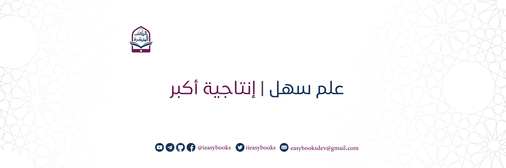

# الكتب المٌيسّرة

**الكتب المُيسّرة** هو مشروع يهدف إلى:

📚 تسهيل وتيسير وصول المسلمين بكافة مستوياتهم إلى الكتب الإسلامية الأساسية في شتّى علوم الإسلام مثل العقيدة، السيرة والحديث بطرق تقنية حديثة وسلسة.  
💻 إنشاء أدوات وبرامج تُسهم في إثراء المحتوى التقني الإسلامي من خلال زيادة إنتاجية الدعاة أو من خلال توظيف التقنيات المختلفة في مجالات الدعوة والعلم الشرعي.

يمكنكم متابعة مشروع **الكتب المُيسّرة** والتواصل معنا من خلال:

💬 قناتنا على تيليجرام
https://t.me/ieasybooks

📹 قناتنا على يوتيوب
https://youtube.com/@ieasybooks

🐦 حسابنا على تويتر
https://twitter.com/iieasybooks

📜 صفحتنا على فيسبوك
https://fb.com/ieasybooks

👨‍💻حسابنا على GitHub (للمبرمجين)
https://github.com/ieasybooks

✉️ بريدنا الالكتروني
easybooksdev@gmail.com

دعمكم لنا يُساعدنا في الإستمرار من خلال التفاعل مع منتجات المشروع بالتحميل والتقييم (الإيجابي ✅ والسلبي ❎) والنصح لنا ومراسلتنا بأفكاركم النّيّرة 💡⚡️

نراكم على خير ❤️

ملاحظة: لن نُكثر النشر إلا فيما يتعلق بمنتجات المشروع، فمتابعتك لنا لن تزجعك بإذن الله 😉😁
